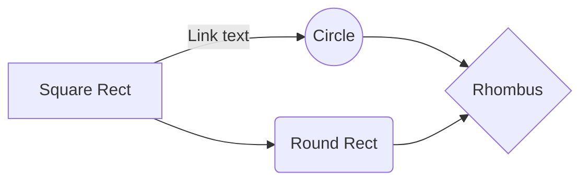

# Final Review
> **Note:** Bash is not included on the final exam

## Definition

### Operator Overloading
- give meaning to C++ operators for user-degined types
``` cpp
struct Vec {
  int x;
  int y;
}
Vec operator+(const Vec &v1, const Vec &v2) {
  Vec newVec{v1.x + v2.x, v1.y + v2.y};
  return newVec;
}
```

### Default Arguments
- `void func(int a, int b = 1){...}`
- parameters with default arguments **must** appear last

### Pointer & Reference
- pointer
    - can be null
    - can change
    - cannot pointer to a reference
      ``` cpp
      int y = 10;
      int &z = y;  // z is a reference
      int *p = &z; // p points to y
      ```
- reference
    - can reference to a pointer
    - cannot leave it uninitialize
    - cannot change  
    - cannot reference to a reference
    - cannot have an array of reference
    - **must** initialize with `lvalue`

### Const
``` cpp
int x = 10;
const int *p1 = &x; // p is a pointer to a constant int
int * const p2 = &x; // p2 is a constant pointer to int
```
> **Conclusion:** if `const` is the first word, it is declared for the second word; 
> otherwise, it is declared for the word before it.


### Stream
- ostream
    - `cin.fail()` returns true if read fails or EOF
    - `cin.eof()` returns true if EOF
    - `cin.clear()` acknowledges failure
    - `cin.ignore()` ignores a single character
    - `getline(cin, s)` will get the entire line until a `\n` is encountered
- stringstream
- fstream

### Dynamic Memory
``` cpp
Node *np = new Node;
...
delete np;

int *arr = new int[n];
...
delete [] arr;
```
- memory leak: forget to free previous storage
- dangling pointer: a pointer pointes to the memory location of the deallocated memory

### Preprocessor
- modifies the program text before compilation
``` cpp
// set proprocessor variable
#define MAX 100

// check defines
#ifndef CLASS_NAME
...
#endif

// show the debug logs: g++ -DDEBUG debug.cc
#ifdef DEBUG
// debug.cc
...
#endif
```

### Deperate Compilation
- Preprocessing
- compiler 
- linker
- `-c:` compile only, don't link, output an object file
> **Note:** 
> - always use include guards
> - never put `using namespace std;` in .h file
> - never include .cc file in .h file
> - always use `std::in`, `std::out` in .h file 

### Makefile
- full program
``` make 
myprogram: main.o vec.o
  g++ main.o vec.o -o myprogram
  
vec.o: vec.cc vec.h
  g++ -std=c++14 -c vec.cc
  
main.o: main.cc vec.h
  g++ -std=c++14 -c main.cc
  
.PHONY: clean

clean:
  rm *.o myprogram
```
- if we define `CXX` and `CXXFLAGS`, we don't need to tell make how to compile
``` make 
CXX = g++
CXXFLAGS = -std=c++14  -Wall
OBJECTS = main.o vec.o
EXEC = myprogram

${EXEC}: main.o vec.o
  ${CXX} ${CXXFLAGS} ${OBJECTS} -o ${EXEC}
  
vec.o: vec.cc vec.h
  // can omit the recompile lines since make is smart
main.o: main.cc vec.h
  
.PHONY: clean

clean:
  rm ${OBJECTS} ${EXEC}
```
- we can use `g++ -MMD vec.cc` to create a `.d` file which is a dependency file
``` make
CXX = g++
CXXFLAGS = -std=c++14  -Wall -MMD
OBJECTS = main.o vec.o
EXEC = myprogram
DEPENDS = ${OBJECTS:.o=.d}

${EXEC}: ${OBJECTS}
  ${CXX} ${CXXFLAGS} ${OBJECTS} -o ${EXEC}

-include ${DEPENDS}

.PHONY: clean

clean:
  rm ${OBJECTS} ${EXEC}
```

